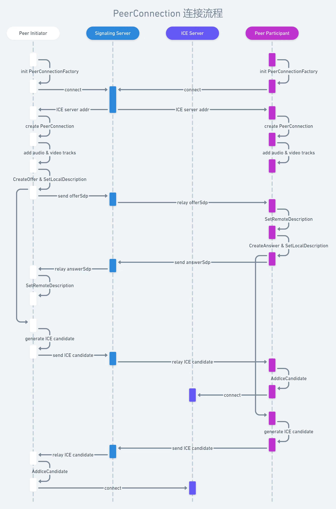

### webrtc链接的建立

#### 图片描述

#### 房间
调用房间创建的接口，则`创建房间`  

调用房间加入的接口，则`加入房间`，加入房间的流程：  
- 用户需要调用加入房间的接口
- 如果房间不存在，提示房间不存在。存在则下一步
- 如果房间存在，判断房间是否已经满员，如果满员则提示房间已满，如果未满员则下一步
- 进入房间，房间人数+1
- 与房间内的其他人建立链接

`退出房间`，退出房间的流程：  

普通用户正常退出
- 正常退出即用户点击挂断按钮，通过socket通知房间内的其他人，自己退出房间
- 清空本地user数据
- 房间人数-1
普通用户刷新页面
- 刷新页面即用户关闭页面，通过socket通知房间内的其他人，自己退出房间
- 房间人数-1
- 刷新完成之后，用户重新建立连接
- 房间人数+1

房主退出
- 房主退出即用户点击挂断按钮，通过socket通知房间内的其他人，自己退出房间
- 清空本地user数据
- 给所有人发消息，房主退出，房间解散
- 删除房间
房主刷新页面
- 刷新页面即用户关闭页面，通过socket通知房间内的其他人，自己退出房间
- 房间人数-1
- 刷新完成之后，用户重新建立连接（房主身份不变）
- 房间人数+1

⚠️**刷新情况下会产生新的socket**  

